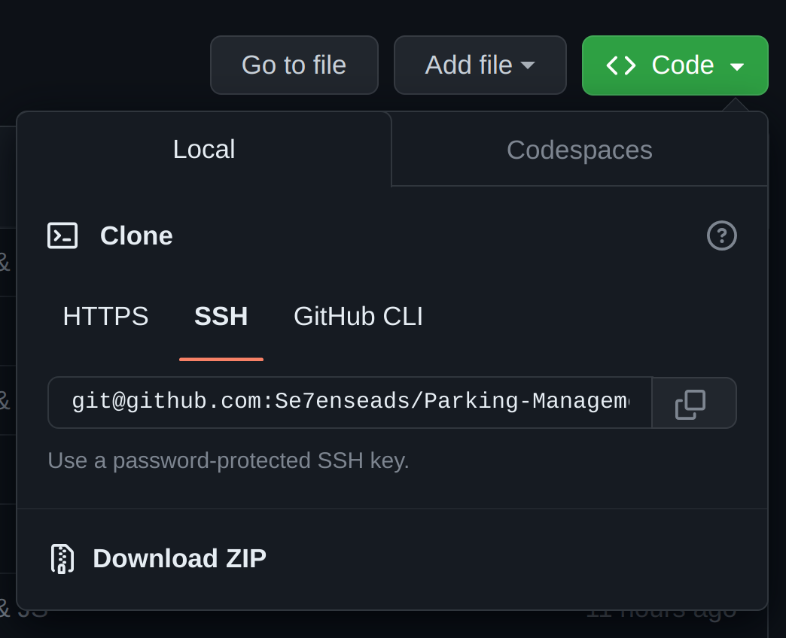

# Parking Lot System

The Parking Lot System is a web application that allows the gateman to manage and track entries in a parking lot. It provides functionality to add new entries, view existing entries, and delete entries from the system.

## Table of contents

- [Features](#features)
- [Technologies](#technologies-used)
- [Getting Started](#🚀-getting-started)
- [Usage](#usage)
- [License](#📝-license)

## Features

- Add new entries to the parking lot system by providing owner details, vehicle model, number plate, entry date, and exit date.
- View a list of all entries in the parking lot system, including owner information, vehicle details, and entry/exit dates.
- Delete entries from the parking lot system, removing them from the list.

## Technologies Used

- **HTML/CSS:** Front-end structure and styling.
- **JavaScript:** Programming language for client-side logic and interaction.
- **Bootstrap:** CSS framework for responsive design and pre-styled components.

# 🚀 Getting Started

To run the Parking Lot System locally on your machine, follow these steps:

## GIT
To get the repo locally you need to clone this repo. Ensure you have [Git](https://git-scm.com/) installed onto your local machine.

To check if git is already installed, run this command in your terminal:

```bash
git --version
```

### Using https

```bash
git clone https://github.com/Se7enseads/Parking-Management-System.git
```

### Using [SSH](https://docs.github.com/en/authentication/connecting-to-github-with-ssh)

To use ssh your first need to [fork](https://docs.github.com/en/get-started/quickstart/fork-a-repo) this repo onto your github account then use the ssh provided under the code button.



```bash
git@github.com:[Your-username]/[repo]
```

For more information about git you can checkout the git [Documentation.](https://git-scm.com/docs)

## JSON Server

To run this challenge you will need a [Mock API (Application Programming Interface)]() or Mock server to create an APi to fetch data from, in our case Characters.

To start using JSON Server, we need to install it.

1. First check if NPM(Node Package Manager) is already installed:

```bash
npm -v
```

Make sure that the number displayed is greater than 9 or better is the latest. **If so continue to step 3**

<mark>**Note:**</mark> To download the latest version of , on the command line, run the following command:

```bash
npm install -g npm
```

2. To install npm it is recommended to install via [NVM](https://www.linuxcapable.com/how-to-install-node-js-on-ubuntu-linux/#Section-3-Installing-Nodejs-Using-Node-Version-Manager-NVM) or through the official [Documents](https://github.com/nvm-sh/nvm#install--update-script)

3. We'll install JSON Server globally on your machine via NPM.

```bash
npm install -g json-server
```

With the command above, you should now be able to spin up a mock server from any directory on your computer.

4. To actually start the JSON Server, run the following command from the same directory that the [name].json file is in. In our case the [name].json is db.json:

```bash
json-server --watch db.json
```

When run, you'll see some messaging about how to access our JSON data. By default, JSON Server will start up on port 3000. You should see a notice that you can access the server at http://localhost:3000


**For more information about JSON Server checkout their [homepage.](https://github.com/typicode/json-server)**

## Usage

- Upon opening the application, you will see a form where you can enter the owner details, vehicle model, number plate, entry date, and exit date.
- Fill in all the required fields and click the "Add Entry" button to add a new entry to the parking lot system.
- The newly added entry will appear in the table below the form.
- To delete an entry, click the "Delete" button next to the corresponding entry in the table.

# 📝 License

Copyright © 2023 [Kyle Mututo.](https://github.com/Se7enseads)<br />
This project is [MIT](LICENSE) licensed.